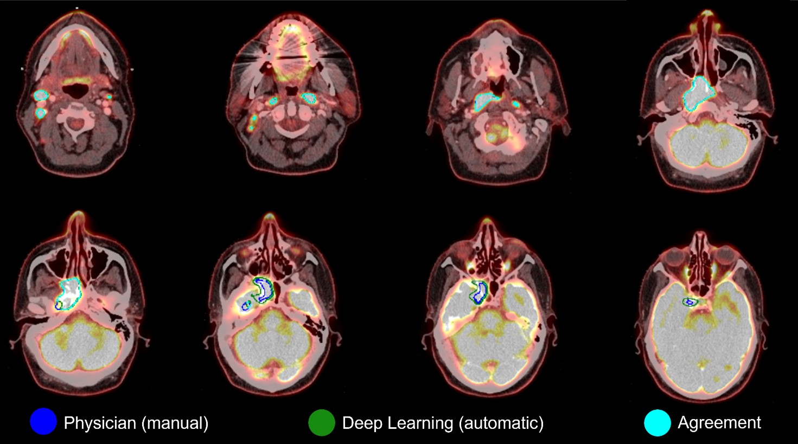

# Clinical evaluation of deep learning for tumour segmentation on PET/CT scans of head and neck cancer

## Update (17th may 2023): This repository is currently under construction and will be up-and-running within a few days.

Our research group implemented established deep learning frameworks and investigated their ability to delineate tumour volumes on PET/CT images.

Information about this study inluding the protocol and statistical analysis plan (SAP) is available at: 

https://www.rigshospitalet.dk/english/departments/centre-of-diagnostic-investigation/department-of-clinical-physiology-nuclear-medicine-and-pet/research/research-projects/Pages/default.aspx

and 

https://www.isrctn.com/ISRCTN16907234?q=16907234&filters=&sort=&offset=1&totalResults=1&page=1&pageSize=10

Please cite the following paper, if you are using the tools shared in this repository:
    Will be added upon publication
    

### Introduction
This repository holds all code we used to implement five different openly available Deep Learning methods.
The links marked "our copy" hold the exact versions of the code, that were used in the publication.
Here, it is possible to review the exact (few) changes we made to the original code of the included methods.

Methods implemented:
* DeepMedic. [Original repo.](https://github.com/deepmedic/deepmedic) [Our copy.](https://github.com/CAAI/deepmedic_DGK)
* nnU-Net. [Original repo.](https://github.com/MIC-DKFZ/nnUNet) [Our copy.](https://github.com/CAAI/nnUNet-DGK)
* Tureckova. [Original repo.](https://github.com/tureckova/Abdomen-CT-Image-Segmentation) [Our copy.](https://github.com/CAAI/tureckova-DGK)
* Swin-UNETR. [Original repo.](https://github.com/Project-MONAI/research-contributions/tree/main/SwinUNETR/BTCV) [Our copy.](https://github.com/CAAI/SwinUNETR-DGK)
* InnerEye. [Original repo.](https://github.com/microsoft/InnerEye-DeepLearning) [Our copy.](https://github.com/CAAI/InnerEye-DeepLearning-DGK)

The MEDIcaTe package contains the tools used to pre-process and analyze image data (this draws heavily on well-established tools - you might prefer to use those directly.)

The folder "implemented-methods" uses the MEDIcaTe package and contains all code necessary use the deep learning methods, i.e. to ensure the data adheres to the specifications of each method, and code to calculate evaluation metrics and visualise the output of the methods. 

